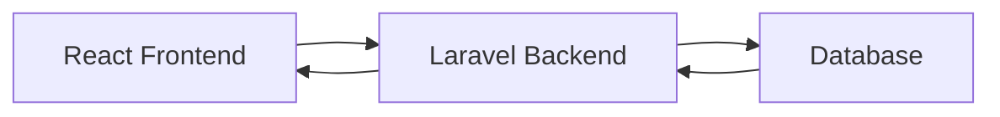

# Project Architecture

## Frontend (React)
- **Framework**: React with Vite
- **Port**: 5173
- **Components**:
  - Login Page (`/login`)
  - Registration Page (`/register`)
  - Dashboard (`/dashboard`)
  - Protected Routes
- **Services**:
  - API Service (axios)
  - Authentication Context

## Backend (Laravel)
- **Framework**: Laravel 12
- **Port**: 8000
- **API Routes**:
  - `POST /api/register`
  - `POST /api/login`
  - `POST /api/logout`
  - `GET /api/user`
- **Authentication**: Laravel Sanctum
- **Database**: SQLite (default)

## Data Flow

## Features Implemented
1. User Registration
2. User Login
3. Protected Dashboard
4. User Logout
5. Token-based Authentication
6. CSRF Protection